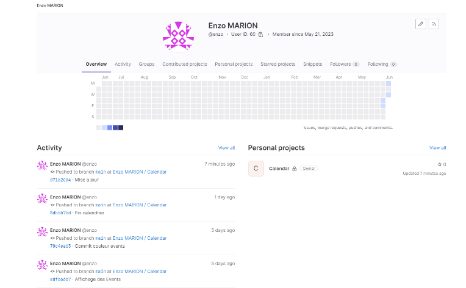

**[Référence :]{.underline}** n/a

**[Plan de classement :]{.underline}**

**[Niveau de confidentialité :]{.underline}** Confidentiel

**[Mises à jour]{.underline}**

  --------- ------------ --------------- --------------------------------------
  Version   Date         Auteur          Description du changement

  1.0.0     25/06/2023   MARION Enzo     Création -- Présentation entreprise

  2.0.0     26/06/2023   MARION Enzo     K2 -- module astreinte

  3.0.0     27/06/2023   MARION Enzo     

                                         

                                         
  --------- ------------ --------------- --------------------------------------

**[Validation]{.underline}**

  --------- ------------ ------------------- ----------------------------------
  Version   Date         Nom                 Rôle

  1.0.0     26/06/2023   SIBERT Rodolphe     Remis Pour Évaluation

                                             

                                             
  --------- ------------ ------------------- ----------------------------------

**[Diffusion]{.underline}**

  --------- ---------- --------------- --------------------------------------
  Version   Date       Nom             Rôle

                                       

                                       

                                       

                                       
  --------- ---------- --------------- --------------------------------------

# Table des matières {#table-des-matières .list-paragraph .TOC-Heading}

[1 Présentation de la société sarl Kyxar :
[2](#présentation-de-la-société-sarl-kyxar)](#présentation-de-la-société-sarl-kyxar)

[1.1 Mes outils chez Kyxar :
[3](#mes-outils-chez-kyxar)](#mes-outils-chez-kyxar)

[1.2 Gestion de projets à Kyxar :
[7](#gestion-de-projets-à-kyxar)](#gestion-de-projets-à-kyxar)

[1.2.1 Gestion de projet Kyxar - IDNext
[7](#gestion-de-projet-kyxar---idnext)](#gestion-de-projet-kyxar---idnext)

[1.2.1.1 Bonnes pratiques: [8](#bonnes-pratiques)](#bonnes-pratiques)

[1.2.1.2 En cours de projet:
[9](#en-cours-de-projet)](#en-cours-de-projet)

[1.3 Description de la mission
[10](#description-de-la-mission)](#description-de-la-mission)

[1.3.1.1 Objectifs du module astreinte:
[10](#objectifs-du-module-astreinte)](#objectifs-du-module-astreinte)

[1.3.1.2 Fonctionnalités du module astreinte:
[10](#fonctionnalités-du-module-astreinte)](#fonctionnalités-du-module-astreinte)

[1.3.1.3 Architecture technique:
[10](#architecture-technique)](#architecture-technique)

[1.3.1.4 Planning prévisionnel :
[11](#planning-prévisionnel)](#planning-prévisionnel)

[1.3.1.5 Risques identifiés:
[12](#risques-identifiés)](#risques-identifiés)

[1.3.1.6 Suivi du projet: [13](#suivi-du-projet)](#suivi-du-projet)

[2 K2 sur l'intranet Kyxar.
[14](#k2-sur-lintranet-kyxar.)](#k2-sur-lintranet-kyxar.)

[2.1 Projet Astreinte Kyxar
[15](#projet-astreinte-kyxar)](#projet-astreinte-kyxar)

[2.1.1 Besoin du Client [15](#besoin-du-client)](#besoin-du-client)

[2.2 Analyse du besoin exprimé
[16](#analyse-du-besoin-exprimé)](#analyse-du-besoin-exprimé)

[2.2.1.1 Saisie des astreintes à venir :
[16](#saisie-des-astreintes-à-venir)](#saisie-des-astreintes-à-venir)

[2.2.1.2 Cron : [16](#cron)](#cron)

[2.2.1.3 Saisie des astreintes à venir :
[16](#saisie-des-astreintes-à-venir-1)](#saisie-des-astreintes-à-venir-1)

[2.3 Présentation des outils utilisé lors de ce projet :
[17](#présentation-des-outils-utilisé-lors-de-ce-projet)](#présentation-des-outils-utilisé-lors-de-ce-projet)

[2.3.1 Présentation de docker :
[17](#présentation-de-docker)](#présentation-de-docker)

[2.3.2 Gestion du projet avec Gitlab :
[18](#gestion-du-projet-avec-gitlab)](#gestion-du-projet-avec-gitlab)

[2.3.3 Outils de Développement :
[19](#outils-de-développement)](#outils-de-développement)

[2.4 Présentation du module astreintes :
[20](#présentation-du-module-astreintes)](#présentation-du-module-astreintes)

[3 Conclusion : [22](#_Toc138834511)](#_Toc138834511)

[3.1 Table des Figure : [22](#table-des-figure)](#table-des-figure)

# Présentation de la société sarl Kyxar : 

La SARL KYXAR est une société à responsabilité limitée immatriculée sous
le SIREN 414517771. Elle opère dans le secteur de la programmation
informatique depuis 25 ans. Basée à Romans-sur-Isère (26100),
l\'entreprise compte une équipe de 36 professionnels répartis sur 5
pôles. En 2020, son chiffre d\'affaires s\'élevait à 1 562 100,00 €. Le
total de son bilan a augmenté de 0,41 % entre 2019 et 2020. Les gérants
de l\'entreprise sont Christophe MASSON et Rodolphe SIBERT. Avec une
infrastructure riche et variée Avec 8 SAN et 5 hyperviseur sur chaque
SAN qui vont gérer les 160 Vm, la gestion de SAN se font avec des HDD en
Raid 6 et des SSD en Raid 1.

## Mes outils chez Kyxar : 

**Comptes**

Login : enzo

(pour rocket.chat : enzo@kyxar.fr, pour active directory
enzo@kyxar.dom),\
Mot de passe pour différents services : « donné par l'entreprise »

**Application**

Comptes définis sur les application suivantes :

-   **K2**

    -   Gestion client, projet, rapport de temps, facturation, wiki,
        congés

    -   Accessible uniquement depuis l'intranet de la société
        <http://intranet.kyxar.priv>

-   **Redmine**

    -   Gestion des tickets clients

    -   Accessible depuis <http://apps.kyxar.fr/redmine>

-   **Rocket.Chat**

    -   Messagerie collaborative

    -   URL : <http://apps.kyxar.fr:3000>

    -   Accès web URL : <https://apps.kyxar.fr> (https)

    -   Dispose une app mobile sur les stores. Utiliser
        <https://apps.kyxar.fr> comme serveur

-   **KyCloud**

    -   Serveur de partage de fichiers (équivalent Dropbox), Calendrier
        partagé

    -   Accessible depuis <http://kycloud.kyxar.fr>

    -   Permet de paramétrer les agendas caldav sous Thunderbird / iOS /
        Android

-   **Gitlab**

    -   Accessible depuis <http://gitlab.kyxar.fr>

    -   Serveur Git, code review et suivi des livraisons, intégration
        continue

    -   Hébergement aussi de dépôts GIT simples via ssh

-   **Outils divers**

    -   Nombreux outils système, supervision, admin des BDD, support

    -   Accessibles sur la page <http://intranet.kyxar.priv/outils>

-   **Partage de fichiers**

    -   Accessible depuis
        [\\\\dagobah8\\intranet](file:///\\dagobah8\intranet) ou
        \\\\dagobah18\\intranet

    -   Tous les fichiers clients, projets, internes, marketing, etc ...

-   **Licence visioconf :** Licence webex meeting

    -   [www.webex.fr](http://www.webex.fr)

    -   Se logguer avec son email & passwd ci-dessus

**Serveurs principaux**

[Kuat]{.underline}

-   Serveur d'application de gestion (K2, Dolibarr)

-   Serveur de fichiers bureautiques

[Dagobah18]{.underline}

-   Serveur de développement avec php & fpm 5.4 5.5 5.6 7.0 7.2
    (<http://dev55.kyxar.priv> ou <http://dev55.kyxar.fr>). Remplacer 55
    par le numéro de version php souhaité

[Dagobah8]{.underline}

-   Vieux serveur de développement php 5.1 (<http://dev.kyxar.priv> ou
    <http://dev.kyxar.fr>)

-   Vieux serveur de développement php 5.3 (<http://php53.kyxar.priv> ou
    <http://php53.kyxar.fr>)

-   r~~epository principal des projets git locaux (hors github)~~
    Déplacé sur gitlab

[Pyxis, pyxis53, pyxis55 newpyxis]{.underline}

-   serveurs principaux d'hébergement mutualisé (http, mysql, dns)

-   services « clients » Kyxar : extranet, webmail

-   plusieurs variantes (pyxis53 pour les projets en php 5.3, newpyxis
    en vm --bascule en cours-)

-   Depuis php 5.5 utilisation de FPM pour avoir 5.4, 5.5, 5.6, 7.0 &
    7.1 sur le même serveur

[Tatooine]{.underline}

-   serveur de mail : service, antispam, pop3, imap, smtp, autoreply

-   Paramètres

    -   Serveur de courrier entrant : pop.kyxar.fr ou imap.kyxar.fr

    -   Serveur de courrier sortant : smtp.kyxar.fr

    -   Adresse du webmail : <http://webmail.kyxar.fr>

    -   Aide sur <http://www.kyxar.fr/extranet/aide/> Vous pouvez
        modifier votre mot de passe de messagerie en vous connectant à
        l\'extranet Kyxar : <http://kyxar.fr/extranet>.

**Procédures**

Nous mettons en place petit à petit des procédures pour assurer la
qualité des livraisons et une homogénéité des actions quelque soit les
projets. Les procédures sont à deux endroits :

-   Fichiers bureautiques \\\\kuat.kyxar.priv\\intranet\\Documents
    Internes\\Procédures

-   Wiki K2 : <http://intranet.kyxar.priv/> rubrique Wiki / procédures

**Gestionnaire de mots de passe**

**La solution RoboForm a été retenue comme gestionnaire de mots de passe
sécurisés pour les projets web et application mobile.
L\'applicationcation existe pour Firefox, Chrome, Safari, iOS et
Android, Windows, Mac et Linux.**

{width="3.1041666666666665in"
height="3.0652777777777778in"}{width="2.428472222222222in"
height="0.5194444444444445in"}

Nous sommes en contrat Business, une licence par personne. La solution
est intéressante puisqu'elle permet de sauvegarder les données
d\'entreprise (partagées) et personnelles (visibles que par le compte
logué). Tout ce qui n\'est pas dans un dossier partagé devient une
donnée personnelle.

Attention, il y a trois modules interconnectés :

-   Le site de roboform (gestion du compte, des données)

-   L'extension du navigateur (autocomplete des données, autosave sur
    nouveau login)

-   L\'application windows/mac embarquée (facultative, l\'extension peut
    attaquer directement le site web mais je conseille d\'installer
    l\'application).

Lien de téléchargement : <https://www.roboform.com/download>

Les comptes sont créés, un mail de roboform est envoyé pour activer son
compte. Attention, votre mot de passe est la clé d\'encryptage des
données. Mot de passe perdu (master password) données perdues.

Dossiers partagés pour l\'équipe :

-   Kyxar Développements

-   Kyxar Fournisseurs

-   Kyxar Administration

-   Kyxar Système

**Equipe**

Laeticia REBECCHI <laetitia@kyxar.fr> secrétariat 900

Christophe Masson <masson@kyxar.fr> gérant 901

Rodolphe Sibert <sibert@kyxar.fr> gérant 902

Yohan Martinez <yohan@kyxar.fr> directeur commercial 906

Estelle Dequivre <estelle@kyxar.fr> chargée d'affaires 911

Macha Guilmin <macha@kyxar.fr> chargée d'affaires 923

Malorie Aussert <malorie@kyxar.fr> chargée d'affaires 917

Isabelle VIAL <isabelle@kyxar.fr> assistante commerciale 920

Mickael Lux <mickael@kyxar.fr> chef de projet 912

Rémy Fayon <remy@kyxar.fr> chef de projet 924

Florent Arnaud <florent.a@kyxar.fr> chef de projet 929

Caroline Dalla-Serra <caroline@kyxar.fr> chef de projet 904

Tiphanie Schmitt <tiphanie@kyxar.fr> chef de projet 935

Etienne Lefaivre <etienne@kyxar.fr> directeur technique 907

Yohan Sanial <yohan.sanial@kyxar.fr> admin systèmes & réseau 916

Jael Costa <jael@kyxar.fr> admin systèmes & réseau 928

Florent Morin <florent@kyxar.fr> graphiste / inté / SEO 903

Sylvain Morgallet [sylvain@kyxar.fr](mailto:guillaume@kyxar.fr)
graphiste / inté 909

Nathan Brun <nathan@kyxar.fr> graphiste / video

Vincent Collomb <vincentc@kyxar.fr> graphiste / inté 922

Jean-François Arnaud <jf@kyxar.fr> développeur 905

François Prost <francois@kyxar.fr> développeur 914

Anthony Lafont <anthony@kyxar.fr> développeur 910

Lucie Chomel <lucie@kyxar.fr> développeur 915

Corentin Le Bail <corentin@kyxar.fr> développeur 925

Dylan Fraisse <dylan@kyxar.fr> développeur 919

Stéphane Marcilloux <stephane@kyxar.fr> développeur 927\
Martial Le Cun <martial@kyxar.fr> développeur 918

Ludovic Marion <ludovic@kyxar.fr> développeur 931

Romain Sylvestre <romain@kyxar.fr> développeur 932

Renaud Blampain <renaud@kyxar.fr> développeur 930

Maxime Blouin <maxime@kyxar.fr> développeur 933

Salle de réunion (pieuvre) 913

Salle RDC 921

**Numéros de téléphone extérieur : Kyxar : 04 75 720 415 • Fingerprint :
04 75 70 74 75 • IDNext : 04 75 70 18 11\
Conférence tel : 04 28 42 20 00 (code 1234#)**

Ils ont aussi des Comptes d'information :

Comptes mail information générale : <info@kyxar.fr> & <info@idnext.net>

Compte mail support : <support@kyxar.fr>

## Gestion de projets à Kyxar : 

La gestion de projets kyxar est très bonne étant donné que c'est leur
métier de gérer et suivre un projet pour qu'il aboutisse.

### Gestion de projet Kyxar - IDNext

• Définition de l\'équipe projet:

1\. Le chef de projet est validé lors des réunions hebdomadaires.

2\. L\'équipe projet est validée lors des réunions hebdomadaires.

• Contrôles administratifs:

1\. Le projet K2 est clairement identifié.

2\. Les heures sont entrées sur le projet K2.

3\. Utilisation de Redmine pour l\'identification du projet:

• Création d\'un projet Redmine dédié si nécessaire.

{width="8.127083333333333in"
height="1.3993055555555556in"}

> []{#_Toc138839571 .anchor}Figure : Ticket redmine

• Création d\'un ou plusieurs tickets.

• Communication d\'informations.

#### Bonnes pratiques:

> • Utilisation de Rocket chat pour la création d\'un canal
> \"team\_\$nom_projet\" pour les projets en cours avec plusieurs
> interlocuteurs.
>
> {width="6.2868055555555555in"
> height="2.95625in"}
>
> []{#_Toc138839572 .anchor}Figure : Outils de commutations RoketChat

• Définition des grandes phases du projet.

• Lancement du projet.

> • « Kick-off » du projet externe: réunion de lancement avec le client,
> introduction du CDP (Chef de Projet).

• Questions à poser au client avant de commencer le projet.

• Rédaction d\'un compte rendu concis par le CDP après le kick-off et
envoi à l\'équipe.

• Rédaction des spécifications finales à un niveau plus détaillé.

• Découpage du projet et des tickets.

• Planification macro avec un Diagramme de Gantt.

• Mise en place d\'un environnement de développement avec Git.

• Gestion des projets généraux et des clients multi-projets.

• Accès Git pour les clients.

#### En cours de projet:

{width="5.575694444444444in"
height="2.2875in"}

> • Validation des maquettes par le client ou réception/validation des
> maquettes si l\'UI/UX est réalisé par un tiers.

• Réunion de passation des maquettes à l\'intégration avec une revue par
un développeur.

• Définition du cahier de recette.

• Préparation du plan de mise en production.

> • Préparation des aspects liés au système en coordination avec un
> administrateur système si nécessaire.

• Gestion du nom de domaine et de l\'hébergement.

• Assurer une planification hebdomadaire efficace des équipes.

• Suivi régulier de l\'avancement du projet avec des réunions d\'équipe.

• Identification et gestion des risques tout au long du projet.

> • Communication régulière avec le client pour partager les avancées et
> résoudre les problèmes éventuels.

• Respect des délais et ajustement de la planification si nécessaire.

• Test et validation des fonctionnalités développées.

• Correction des bugs et des problèmes identifiés.

• Préparation de la documentation technique et utilisateur.

• Formation du client à l\'utilisation du module astreinte.

• Coordination avec l\'équipe de déploiement pour assurer une mise en
production réussie.

## Description de la mission

La mission qui m'a été confiée lors de ce stage portait sur le
développement du module astreinte.

#### Objectifs du module astreinte:

> • Le module astreinte est destinée à une utilisation interne à KYXAR.
> Pour cette raison il ne sera accessible que sur l'intranet de la
> société. Il doit permettre aux utilisateurs de KYXAR de gérer
> efficacement les astreintes au sein de leur organisation. En effet les
> administrateurs réseau de la société sont soumis à des astreintes
> hebdomadaires. Ils doivent être joignables à tout moment pour pouvoir
> intervenir sur site. Kyxar est fournisseur d'accès auprès de nombreux
> clients. En cas d'incident, il faut intervenir le plus rapidement
> possible.
>
> Actuellement, 2 dirigeants et 3 employés sont concernés par la gestion
> des astreintes.

• Les objectifs principaux du module astreinte sont les suivants:

-   Permettre aux utilisateurs de planifier et d\'organiser des périodes
    d\'astreinte.

-   Faciliter la gestion des plannings d\'astreinte en permettant la
    création, la modification et la suppression des périodes
    d\'astreinte.

-   Envoyer des notifications aux personnes concernées pour les informer
    de leur astreinte.

-   Assurer la traçabilité des astreintes passées et à venir.

-   Permettre aux utilisateurs de consulter les plannings d\'astreinte
    et de connaître les personnes à contacter pour chaque période
    d\'astreinte.

#### Fonctionnalités du module astreinte:

• Le module astreinte comprendra les fonctionnalités suivantes:

-   Création, modification et suppression de périodes d\'astreinte.

-   Planification des ressources disponibles pour chaque période
    d\'astreinte.

-   Envoi automatique de notifications par courriel aux personnes
    concernées pour les informer de leur astreinte.

-   Consultation des plannings d\'astreinte.

-   Affichage des personnes à contacter pour chaque période
    d\'astreinte.

-   Historique des astreintes passées et à venir.

#### Architecture technique:

• Le module astreinte sera intégré au site intranet existant de KYXAR.

• Il sera développé en utilisant les technologies suivantes :

-   Front-end: HTML, CSS, JavaScript.

-   Back-end : PHP

• Base de données: MySQL dans la version MariaDB.

> • L\'architecture sera basée sur une approche MVC
> (Modèle-Vue-Contrôleur) pour assurer la séparation des préoccupations
> et la maintenabilité du code.

• Des API RESTful seront utilisées pour la communication entre le
front-end et le back-end.

> • La sécurité sera prise en compte lors du développement pour protéger
> les données des utilisateurs et prévenir les attaques potentielles.

#### Planning prévisionnel :

Le module astreinte s'inscrit dans le projet K2. Il avait déjà été conçu
à mon arrivée dans l'entreprise. La phase 1 était achevée. On m'a confié
la réalisation de la phase 2 (Conception et développement du module)

• Phase 1: Analyse des besoins et spécifications (2 semaines)

• Phase 2: Conception et développement du module astreinte (4 semaines)

• Phase 3: Tests et correction des bugs (2 semaines)

• Phase 4: Documentation et formation (1 semaine)

• Phase 5: Déploiement et mise en production (1 semaine)

La société gère un planning où figure chaque employé. Ce tableau est
accessible sur l'intranet. L'illustration suivante permet de voir que
j'apparais dans l'organisation hebdomadaire au même titre que tous les
autres salariés.

{width="6.40325678040245in"
height="5.595790682414698in"}

> []{#_Toc138839574 .anchor}Figure : Planning des salariés dans la
> semaine

#### Risques identifiés:

Lors d'un développement de projet, il existe différentes causes d'echec
possibles. Voici une présentation des éccueils à éviter :

> • Risque de dépassement des délais en raison de contraintes techniques
> ou de difficultés imprévues lors du développement.

• Risque de changement des besoins du client en cours de projet.

• Risque de non-conformité aux attentes du client.

• Risque de sécurité lié à la gestion des données sensibles des
utilisateurs.

> • Risque de manque de ressources humaines ou de compétences pour le
> développement du module astreinte.

• Risque de problèmes de communication interne ou externe.

#### Suivi du projet:

La société Kyxar a mios en place un suivi de projet qui respecte
l'organisation suivante :

> • Des réunions d\'équipe régulières seront organisées pour suivre
> l\'avancement du projet, discuter des problèmes rencontrés et prendre
> les décisions nécessaires.
>
> • Un suivi du budget et des ressources sera effectué pour s\'assurer
> que le projet reste sur la bonne voie.
>
> • Des rapports d\'avancement seront partagés avec le client pour
> maintenir une communication transparente.
>
> • Les tests et la validation des fonctionnalités seront effectués à
> différentes étapes du projet pour assurer la qualité du module
> astreinte.
>
> • Les retours du client seront pris en compte et les ajustements
> nécessaires seront effectués en conséquence.
>
> • Tout risque identifié sera géré de manière proactive pour minimiser
> son impact sur le projet.
>
> Je n'ai pas été concerné par ce suivi de projet. Dès que j'avais un
> souci, je pouvais demander des indications à mon maître de stage. De
> manière impromptue, Monsieur Sibert, profitait d'un moment où il était
> disponible pour venir contrôler l'avancement de mon projet. En
> moyenne, il passait 2 fois par semaine.
>
> {width="4.277117235345582in"
> height="5.983999343832021in"}
>
> []{#_Toc138839575 .anchor}Figure : Gestion projet Kyxar

# K2 sur l'intranet Kyxar. 

K2 est un intranet qui comporte plusieurs modules différents, présentés
ci-dessous :

{width="6.3in"
height="1.9034722222222222in"}

> []{#_Toc138839576 .anchor}Figure : Liste des modules de K2 avec le
> module astreintes

## Projet Astreinte Kyxar

Développement d'un module astreintes pour l'entreprise Kyxar sur leur
intranet K2.

### Besoin du Client 

La demande exprimée par mon maître de stage (Monsieur Sibert) était de
pourvoir gérer les personne d'astreintes sur une semaine.

{width="7.099283683289589in"
height="3.720237314085739in"}Cette demande a été exprimée sous la forme
d'un ticket de demande que vous pouvez voir ci-dessous :

> []{#_Toc138839577 .anchor}Figure : Ticket de demande expliquant le
> besoin

## Analyse du besoin exprimé

Avant de développer quoique ce soit, il est important de bien comprendre
le besoin exprimé. J'ai donc repris toutes les informations contenues
dans le ticket.

#### Saisie des astreintes à venir : 

-   Par défaut, sur l'écran, on affiche le mois courant et les 5
    prochains mois (6 mois en tout).

-   En début de ligne, on affiche le numéro de semaine.

-   Ensuite on affiche les numéros de jour (1-28, 1-29, 1-30, 1-31)

-   En fin de ligne, les boutons radio pour les techs d'astreintes.

Les techniciens d'astreintes ont la colonne astreinte à 1 dans la table
k2users

La demande portait clairement sur :

-   L'ajout de la colonne astreinte de type entier dans la table k2users
    avec les valeurs (0 : pas d'astreinte, 1 : peut être d'astreinte,
    2 : en astreintes en ce moment).

-   La création d'un module nommé mod-astreintes.php avec un point
    d'entrée astreinteAutomate.

-   Le développement de l'écran défini ci-contre ( 3 fonctions :
    chargements des astreintes déjà renseignées sur la période
    d'affichage, écran pour générer le tableau et les formulaires,
    fonctions de validation du formulaire qui enregistre l'astreinte
    dans la base de données).

#### Cron : 

Développer le cron qui tournera tous les lundi matin pour gérer le
changement de personne d'astreintes :

-   Lorsqu'une astreinte qui se termine, le « flag » sur la personne
    passe de 2 à 1.

-   Lorsqu'une nouvelle astreinte commence, il faut

```{=html}
<!-- -->
```
-   Positionner un marqueur (flag) sur la personne concernée de 1 à 2,

-   Envoyer un mail à la personne lui indiquant qu'elle démarre son
    astreinte qui s'achèvera à la date de fin,

-   Mettre dans le fichier /tmp/astreinte.txt l'email, le nom, le
    téléphone de la personne d'astreintes, sous forme d'une série
    key=value, 1 par ligne (ex nom = xxx \\n mobile = xxxxxxxxxx \\n
    email = xxx@kyxar.fr)

#### Saisie des astreintes à venir : 

-   En reprenant le module fait au point 1, si on spécifie une année, on
    affiche sous le même format les 12 mois de l'année sélectionnée avec
    la personne d'astreinte pour la période en face

-   Si la personne connectée est rsi, twoki ou etienne (les 3 employés
    habilités à modifier les données passées), elle peut modifier les
    valeur sur toutes les lignes.

-   Pour les autres utilisateurs, seules les dates dans le futur peuvent
    être éditées (une date dans le passé peut être consultée en lecture
    seule.)

## Présentation des outils utilisé lors de ce projet :

### Présentation de docker :

Docker est une plateforme open-source de gestion des conteneurs et de
virtualisation légère des applications. Il facilite le déploiement et la
gestion efficace des applications de manière portable. Voici ses
principes fondamentaux et avantages clés :

-   Docker utilise des conteneurs légers pour isoler les applications et
    leurs dépendances, partageant le même noyau d\'exploitation. Cela
    permet un démarrage rapide et une utilisation efficace des
    ressources.

-   Avantages de Docker :

```{=html}
<!-- -->
```
-   Portabilité : les conteneurs autonomes créés par Docker peuvent être
    exécutés de manière cohérente sur différents systèmes
    d\'exploitation.

-   Isolation : chaque conteneur s\'exécute de manière isolée, évitant
    les conflits entre les applications.

-   Évolutivité : Docker facilite la gestion de plusieurs conteneurs
    fonctionnant en parallèle, permettant une gestion flexible de la
    charge.

-   Gestion des ressources : Docker fournit des outils pour surveiller
    et gérer les ressources utilisées par les conteneurs.

-   Écosystème riche : Docker dispose d\'un large éventail d\'images
    pré-configurées disponibles sur le Docker Hub, permettant de
    démarrer rapidement avec des applications courantes.

```{=html}
<!-- -->
```
-   Pour utiliser Docker, vous devez créer des fichiers appelés
    Dockerfiles, qui décrivent les étapes pour construire un conteneur.
    Une fois l\'image construite, vous pouvez l\'exécuter pour créer un
    conteneur et démarrer votre application.

En résumé, Docker est une plateforme puissante pour la gestion des
conteneurs et la virtualisation légère des applications. Sa portabilité,
son isolation, son évolutivité, sa gestion des ressources et son
écosystème riche en font un outil précieux pour les développeurs et les
administrateurs système.

### Gestion du projet avec Gitlab : 

{width="2.9309667541557305in"
height="2.034783464566929in"}{width="3.25in"
height="1.645282152230971in"}{width="2.791304680664917in"
height="3.2144488188976377in"}{width="3.4608694225721783in"
height="2.1366065179352582in"}

GitLab est une plateforme de gestion de code source qui utilise le
système de contrôle de version Git. Voici les commandes les plus
utilisées lors de mon stage : commit, add, status et push.

-   Commit : Lorsque vous effectuez des modifications dans votre projet,
    vous pouvez créer un commit pour enregistrer ces changements. Un
    commit est une capture instantanée des modifications apportées à
    votre code à un moment précis. Pour effectuer un commit, vous devez
    spécifier les fichiers que vous souhaitez inclure et fournir un
    message décrivant les modifications effectuées. Cela peut être fait
    en utilisant la commande git commit, suivie du message approprié.

-   Add : Avant de pouvoir effectuer un commit, vous devez ajouter les
    fichiers modifiés à l\'index de Git. L\'index est une zone de
    préparation où vous sélectionnez les modifications que vous
    souhaitez inclure dans votre prochain commit. Pour ajouter des
    fichiers à l\'index, vous pouvez utiliser la commande git add,
    suivie du nom des fichiers que vous souhaitez ajouter. Vous pouvez
    également utiliser git add pour ajouter tous les fichiers modifiés
    dans le répertoire courant.

-   Push : Une fois que vous avez effectué un commit, vous pouvez
    envoyer vos modifications vers un dépôt distant, comme GitLab. Cela
    s\'appelle un push. Lorsque vous poussez vos modifications, elles
    deviennent accessibles aux autres collaborateurs du projet. Pour
    effectuer un push, vous pouvez utiliser la commande git push. Par
    défaut, cela envoie les modifications de la branche actuelle vers la
    branche correspondante dans le dépôt distant.

-   

-   Status : affiche l\'état actuel de votre répertoire de travail et de
    l\'index Git. Il vous montre les fichiers modifiés, les fichiers
    ajoutés à l\'index et les fichiers en attente de commit.

En utilisant ces commandes, vous pouvez facilement gérer votre code
source, enregistrer vos modifications dans des commits et les partager
avec votre équipe via GitLab. Bien sûr, GitLab offre de nombreuses
autres fonctionnalités, telles que la gestion des branches, les demandes
d\'extraction (merge requests), les pipelines CI/CD, etc. Ces
fonctionnalités vous aident à collaborer efficacement sur vos projets et
à automatiser vos processus de développement.

### Outils de Développement : 

Ces outils de développement ont été fait en PHP, SQL, CSS et HTML.

-   PhpStorm :

PhpStorm est un environnement de développement intégré (IDE)
spécifiquement conçu pour le développement d\'applicationPHP. Il est
développé par JetBrains, la même société qui a créé des outils
populaires tels que IntelliJ IDEA, PyCharm et ReSharper.

PhpStorm offre une gamme de fonctionnalités puissantes pour améliorer la
productivité des développeurs PHP. Voici quelques-unes des
fonctionnalités clés de PhpStorm :

-   Éditeur intelligent : PhpStorm dispose d\'un éditeur de code
    intelligent qui offre une assistance contextuelle, une coloration
    syntaxique, une complétion automatique, une vérification des
    erreurs, des refactorisations et bien d\'autres fonctionnalités pour
    faciliter l\'écriture de code.

-   Débogage : Il fournit des outils de débogage avancés, y compris la
    possibilité de placer des points d\'arrêt, d\'exécuter le code pas à
    pas, d\'inspecter les variables, d\'évaluer les expressions et de
    suivre l\'exécution du code.

-   Intégration Git : PhpStorm offre une intégration complète avec Git,
    le système de contrôle de version le plus populaire. Vous pouvez
    effectuer des opérations Git directement depuis l\'IDE, telles que
    la gestion des branches, les commits, les pushs, les pulls, les
    fusions, etc.

-   Gestion de projet : Il permet de gérer facilement les projets PHP,
    en fournissant des fonctionnalités telles que la navigation dans le
    code, la recherche globale, l\'indexation intelligente, la recherche
    et le remplacement, et bien plus encore.

-   Intégration des outils de développement : PhpStorm peut être intégré
    à des outils de développement couramment utilisés tels que Composer
    (pour la gestion des dépendances), PHPUnit (pour les tests
    unitaires), Xdebug (pour le débogage) et bien d\'autres encore.

-   Support des frameworks PHP : Il offre une prise en charge intégrée
    des frameworks PHP populaires tels que Laravel, Symfony, Yii,
    CodeIgniter, etc. Cela facilite le développement, la navigation et
    la compréhension du code des projets basés sur ces frameworks.

-   Prise en charge des technologies web : PhpStorm prend également en
    charge les technologies web telles que HTML, CSS, JavaScript, Type
    Script, XML, etc., ce qui en fait un environnement de développement
    polyvalent pour les projets web.

Ces fonctionnalités font de PhpStorm un choix populaire parmi les
développeurs PHP. Il offre une expérience de développement fluide et
efficace, permettant aux développeurs de se concentrer sur l\'écriture
de code de qualité tout en bénéficiant d\'un large éventail d\'outils et
de fonctionnalités pour accélérer leur workflow.

## Présentation du module astreintes : 

{width="5.729166666666667in"
height="2.9166666666666665in"}Voici à quoi ressemble le module avec les
astreintes :

{width="6.899305555555555in"
height="3.2868055555555555in"}Une contrainte du projet était de rendre
impossible la modification des boutons radio pour les astreintes passées
et pour la semaine courante pour tout le monde sauf Rodolphe, Etienne et
Christophe.

{width="5.482638888888889in"
height="3.308333333333333in"} En revanche on peut voir qu'en 2024 les
personnes peuvent modifier les astreintes.

{width="8.275in"
height="1.7881944444444444in"}\
Ensuite j'ai rendu les semaines 52 et 53 impossibles à cocher au début
de chaque année :

{width="8.288194444444445in"
height="2.0256944444444445in"}

## Présentation du code : 

// Fonction principale pour gérer les étapes de l\'automatisation des
astreintes\
function AstreintesAutomate()\
{\
\
switch(\$\_REQUEST\[\'Etape\'\])\
{\
case \'Nouv\' : return astreintesNouveau(); break;\
case \'Edit\' : return astreintesModifier(); break;\
case \"Cron\" : return astreintesCron(); break;\
default :\
return astreintesNouveau();\
}\
\
}\
\
// Affiche le formulaire pour les nouvelles astreintes\
function astreintesNouveau(){\
return astreintesFormulaire(\"\");\
}

Automates Astreints qui gère plusieurs fonctions, pour la gestion du
module astreinte.

// Modifie les astreintes existantes\
function astreintesModifier(){

Cette fonction a pour but de modifier les astreintes déjà existant dans
la base de données, et de changer le marqueur d'une personne de 2 vers 1
si elle est enlevée de l'astreinte et de 1 vers 2 si la personne passe
d'astreinte.

Voici une autre fonction ci-dessous qui gère la date de début et de fin
d'une semaine d'une année donnée :

// Obetenir la date de début et de fin d\'une semaine d\'une année
donnée\
function getWeekStartEndDates(\$week, \$year){\
\$dto = new DateTime();\
\$dto-\>setISODate(\$year, \$week);\
\$date_deb_astreintes = \$dto-\>format(\'Y-m-d\');\
\$dto-\>modify(\'+6 days\');\
\$date_fin_astreintes = \$dto-\>format(\'Y-m-d\');\
return array(\$date_deb_astreintes, \$date_fin_astreintes);\
}

cela permet de faire appel à cette fonction à n\'importe quel moment
dans le code pour trouver une date en particulier, comme ci-dessous avec
la date de début d'astreinte :

list(\$date_deb_astreintes) = getWeekStartEndDates(\$semaine, \$annee);

Comme expliqué lors du ticket, j'ai aussi fait une fonction Cron qui se
lance chaque lundi par l'entreprise pour envoyé un mail à la personne
d'astreinte avec la date de fin de sont astreintes, la fonction gère
aussi le changement de marqueur de la personne d'astreinte et
l'implémentation du nom, mobile et email de la personne d'astreinte dans
un fichier .txt.

function astreintesCron() {

(\....CODE\.....)

file_put_contents(\"/opt/www/k2/tmp/astreinte.txt\", \'\');\
\
\$usrid = \$row\[\'usrid\'\];\
\$email = \$row\[\'email\'\];\
\$nom = \$row\[\'nick\'\];\
\$mobile = \$row\[\'portable\'\];\
\
\$sql = \"UPDATE k2users SET astreinte = 2 WHERE usrid = :usrid\";\
\$stmt = \$cn-\>prepare(\$sql);\
\$stmt-\>bindParam(\':usrid\', \$usrid);\
\$stmt-\>execute();\
\
\$subject = \"Debut Astreinte\";\
\$message = \"Bonjour,\
\\nVous démarrez votre astreinte aujourd\'hui. Votre astreinte se
termine le \$finAstreinte matin.\
\\nCordialement,\
\\nKyxar\";\
\$headers = \"From: k2 Astreinte \<robot@kyxar.fr\>\";\
\
mail(\$email, \$subject, \$message, \$headers);\
\
\$content = \"nom=\$nom\\nmobile=\$mobile\\nemail=\$email\\n\";\
file_put_contents(\"/opt/www/k2/tmp/astreinte.txt\", \$content,
*FILE_APPEND*);

Voici maintenant la fonction principale de mon code, qui gère et affiche
le formulaire entier avec du HTML et de la mise en forme CSS, elle
permet de gérer les boutons radios afin de connecter la bonne personne à
la bonne semaine sélectionnée et la mettre en bd.

// Affiche le formulaire pour les astreintes\
function astreintesFormulaire(\$D, \$Erreur = \"\")

## Table des Figure :

[Figure 1 : Ticket redmine [8](#_Toc138839571)](#_Toc138839571)

[Figure 2 : Outils de commutations RoketChat
[8](#_Toc138839572)](#_Toc138839572)

[Figure 3 : Outils pour décrire l'avancement d'un projet
[9](#_Toc138839573)](file:///C:\Users\mario\OneDrive\Bureau\Comptre%20rendu%20Projet.docx#_Toc138839573)

[Figure 4 : Planning des salariés dans la semaine
[12](#_Toc138839574)](#_Toc138839574)

[Figure 5 : Gestion projet Kyxar [14](#_Toc138839575)](#_Toc138839575)

[Figure 6 : Liste des modules de K2 avec le module astreintes
[15](#_Toc138839576)](#_Toc138839576)

[Figure 7 : Ticket de demande expliquant le besoin
[15](#_Toc138839577)](#_Toc138839577)

[Figure 8 : Page Astreintes sur K2
[20](#_Toc138839578)](file:///C:\Users\mario\OneDrive\Bureau\Comptre%20rendu%20Projet.docx#_Toc138839578)

[Figure 9 : Modification des astreintes passé impossible
[21](#_Toc138839579)](file:///C:\Users\mario\OneDrive\Bureau\Comptre%20rendu%20Projet.docx#_Toc138839579)

[Figure 10 : Affectations d\'astreintes futur
[21](#_Toc138839580)](file:///C:\Users\mario\OneDrive\Bureau\Comptre%20rendu%20Projet.docx#_Toc138839580)

[Figure 11 : Semaine du mois d\'avant indisponible
[22](#_Toc138839581)](file:///C:\Users\mario\OneDrive\Bureau\Comptre%20rendu%20Projet.docx#_Toc138839581)
